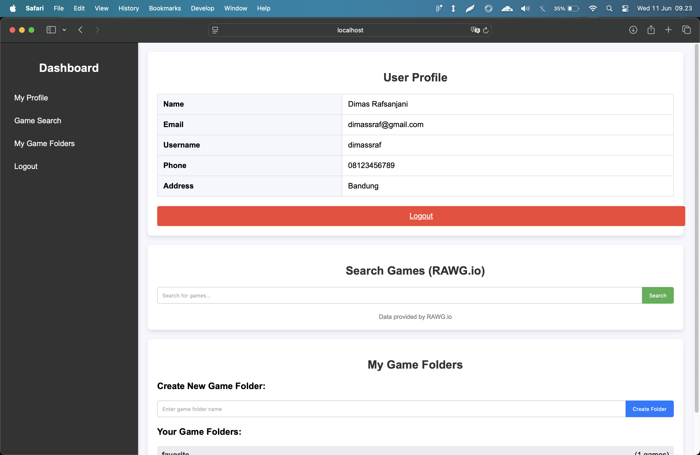
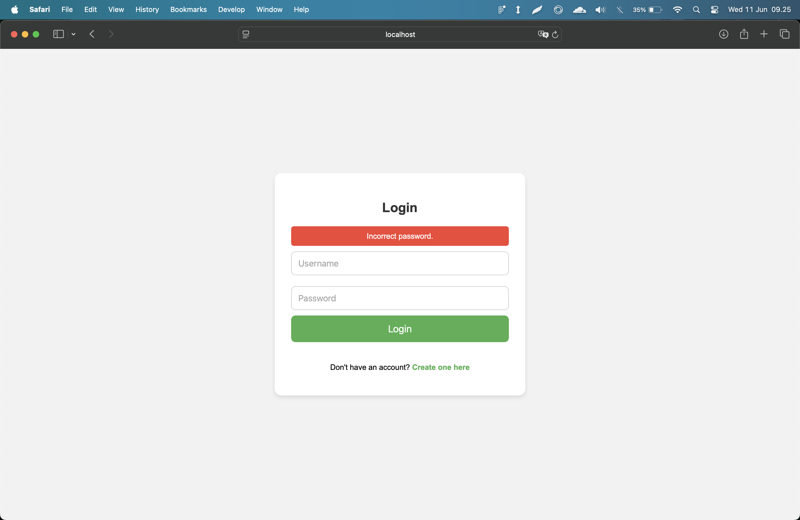
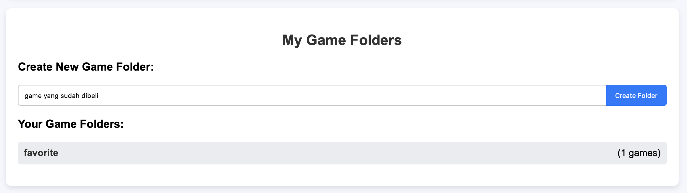
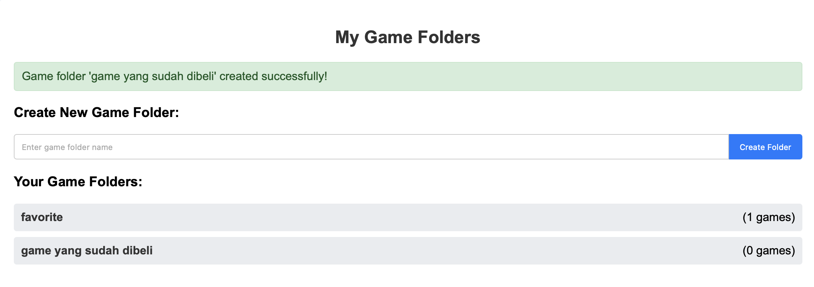
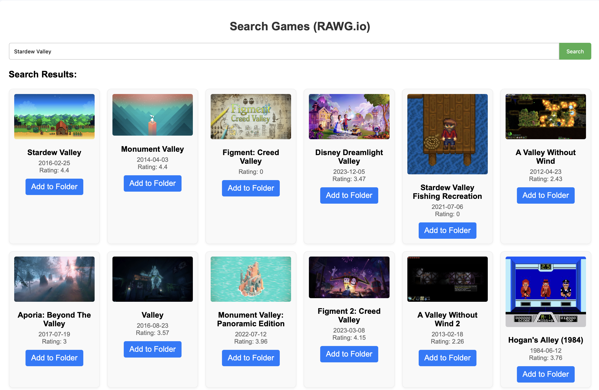
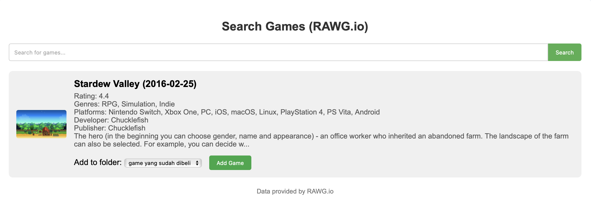
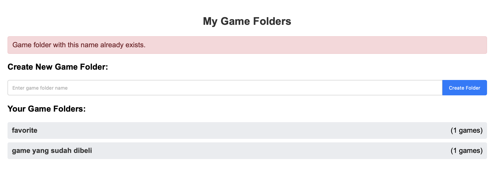
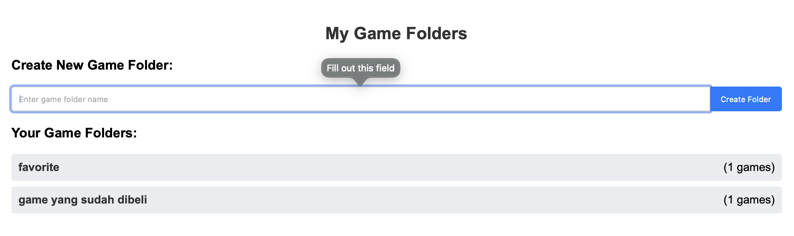

### Analisis Black-Box Testing (Metode: Behavior Testing)

Pengujian ini memvalidasi perilaku aplikasi dari perspektif pengguna akhir dalam skenario penggunaan yang umum.

| ID Tes | Skenario Perilaku (User Story) | Langkah-langkah Pengujian | Data Uji | Hasil yang Diharapkan | Bukti (Screenshot) |
| :--- | :--- | :--- | :--- | :--- | :--- |
| **BT-01** | **Login Pengguna yang Berhasil** | 1. Buka halaman Login. 2. Masukkan username yang terdaftar. 3. Masukkan password yang benar. 4. Klik tombol "Login". | - **Username:** `user_terdaftar` - **Password:** `password_benar` | Pengguna berhasil masuk dan halaman dialihkan ke **Dashboard**. Nama pengguna yang login muncul di halaman Dashboard. | Ambil screenshot halaman **Dashboard** setelah login berhasil.    |
| **BT-02** | **Login dengan Kredensial Salah** | 1. Buka halaman Login. 2. Masukkan username yang terdaftar. 3. Masukkan password yang salah. 4. Klik tombol "Login". | - **Username:** `user_terdaftar` - **Password:** `password_salah` | Halaman tetap di laman Login. Sebuah pesan error yang jelas seperti **"Incorrect password."** atau **"Password salah."** muncul. | Ambil screenshot halaman Login dengan **pesan error** yang ditampilkan.    |
| **BT-03** | **Pengorganisasian Game dari Awal hingga Akhir** | 1. Login ke aplikasi. 2. Di Dashboard, cari bagian "My Game Folders". 3. Klik pada input teks dan masukkan nama folder baru. 4. Klik tombol "Create Folder". 5. Pindah ke bagian "Game Search", cari judul game. 6. Klik tombol "Search". 7. Dari hasil pencarian, klik tombol **"Add to Folder"** pada salah satu game. 8. Pada tampilan detail game, pilih nama folder yang baru saja dibuat dari dropdown. 9. Klik tombol "Add Game". 10. Kembali ke bagian "My Game Folders" dan klik nama folder yang tadi dibuat. | - **Nama Folder:** `My Action Games` - **Judul Game:** `Cyberpunk 2077` | 1. **(Langkah 4):** Folder "My Action Games" muncul di daftar dengan hitungan "(0 games)". Sebuah pesan sukses ditampilkan. 2. **(Langkah 9):** Sebuah pesan sukses ditampilkan. Hitungan game di samping folder "My Action Games" berubah menjadi **"(1 games)"**. 3. **(Langkah 10):** Halaman detail folder terbuka dan menampilkan game "Cyberpunk 2077" di dalamnya. | 1. Screenshot Dashboard setelah folder dibuat. 2. Screenshot Dashboard setelah game ditambahkan (menunjukkan hitungan berubah). 3. Screenshot halaman detail folder yang berisi game baru.            |
| **BT-04** | **Pencegahan Input Duplikat** | 1. Login ke aplikasi. 2. Buat folder baru dengan nama "Test Folder". 3. Setelah berhasil, coba buat folder lagi dengan nama yang sama persis, "Test Folder". | - **Nama Folder:** `Test Folder` | 1. **(Langkah 2):** Folder berhasil dibuat. 2. **(Langkah 3):** Sistem mencegah pembuatan folder. Sebuah pesan error seperti **"Game folder with this name already exists."** muncul. | Ambil screenshot pesan error saat mencoba membuat folder duplikat.    |
| **BT-05** | **Validasi Input Kosong** | 1. Login ke aplikasi. 2. Di bagian "My Game Folders", biarkan input teks kosong. 3. Klik tombol "Create Folder". | - **Nama Folder:** (Kosong) | Sistem mencegah pembuatan folder. Sebuah pesan error seperti **"Game folder name cannot be empty."** muncul. | Ambil screenshot pesan error saat input nama folder kosong.    |

#### Analisis dan Kesimpulan

* **Fokus Pengguna:** Pengujian ini secara ketat mensimulasikan bagaimana pengguna berinteraksi dengan aplikasi untuk mencapai tujuannya. Setiap kasus uji mewakili sebuah "perjalanan" pengguna.
* **Kriteria Keberhasilan:** Aplikasi dianggap berhasil jika semua pesan (baik sukses maupun error) ditampilkan dengan jelas dan pada waktu yang tepat, dan jika data yang ditampilkan (seperti hitungan game) selalu konsisten dengan tindakan yang baru saja dilakukan pengguna.
* **Rekomendasi:** Berdasarkan tabel di atas, aplikasi harus menyediakan umpan balik (feedback) yang informatif untuk setiap aksi pengguna. Jika ada pengujian yang gagal (misalnya, pesan error tidak muncul), maka itu dianggap sebagai bug yang signifikan karena merusak pengalaman pengguna.