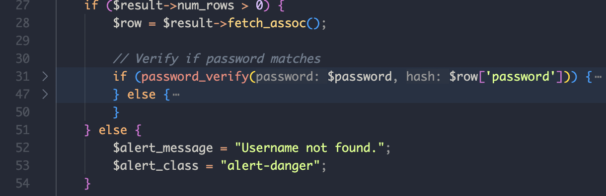
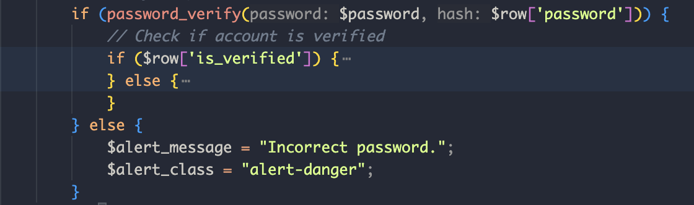
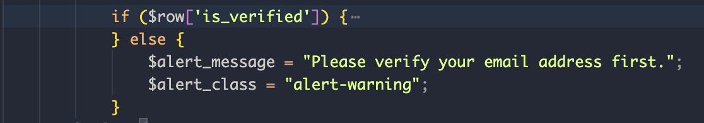
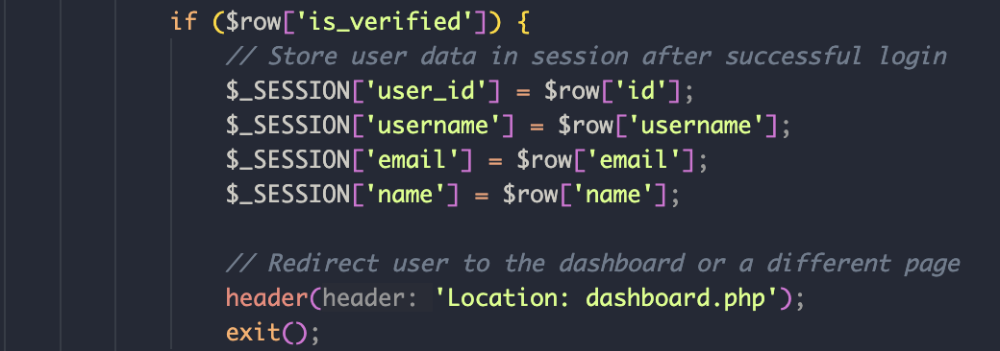

| Bagian | Path | Code | Jalur |
|--------|------|------|-------|
| A1 | Username tidak ditemukan |  | 1. Cek `$result->num_rows > 0` 2. Jika `true`, lanjutkan cek password  3. Jika `false`, tampilkan error|
| A2 | Username ditemukan, password salah |  | 1. Cek `password_verify($password, $row['password'])` 2. Jika `true`, lanjutkan cek verifikasi email  3. Jika `false`, tampilkan error |
| A3 | Username & password benar, belum diverifikasi |  | 1. Cek `$row['is_verified']` 2. Jika `false`, tampilkan error |
| A4 | Username & password benar, sudah diverifikasi |  | 1. Cek `$row['is_verified']` 2. Jika `true`, set session dan redirect ke `dashboard.php` |
